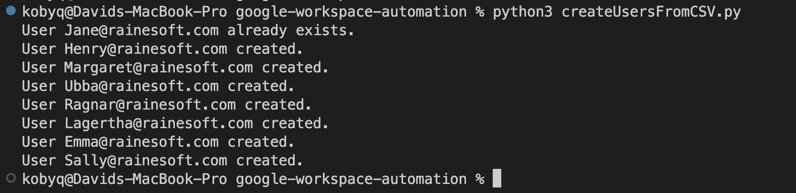
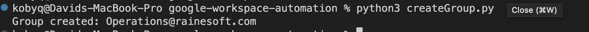
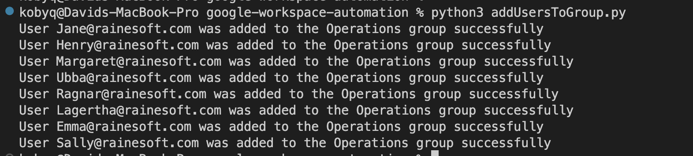

# Google Workspace Automation

## Prerequisites

The following prerequisites are required to run this project.

- [Google Workspace Account](https://support.google.com/a/answer/6365252)
- [Python](https://www.python.org/) - for Scripting

## User Administration

Adding automation for Google Workspace user administration can help streamline the process and reduce manual effort. The steps below outline a plan that will ensure a successful implementation.

### Implementation Plan

1. Define the Scope: Determine which aspects of user administration will be automated, such as creating new users, modifying existing users, deleting users, resetting passwords, creating groups, or updating user attributes.
    1. This should include the order in which they should be completed, and any dependencies or prerequisites. For example, this project creates users from a CSV file, creates a group and then adds users to the group.
    2. It should also include security and compliance requirements as described below.
        1. The user's account must be set to prompt a mandatory password change upon first use.
        2. If passwords are distributed using email, then they must be a unique, single-use (one time) password.
        3. Passwords should meet the following complexity requirements:
            - At least 8 alphanumeric characters
            - At least 1 number
            - At least 1 symbol
            - At least 1 uppercase letter
            - At least 1 lowercase letter

2. Choose an Automation Tool: There are several automation tools available for Google Workspace user administration, such as Google Apps Script, Google Cloud Functions, and third-party tools. This project uses Python and the Google Admin SDK Directory API.

3. Set up Google Workspace: Configure account to allow creating users with [Google Admin SDK Directory API](https://developers.google.com/admin-sdk/directory/v1/quickstart/python). This includes setting up authentication and authorization by creating a service account and granting it the necessary permissions. [See here](https://developers.google.com/workspace/guides/create-credentials#service-account)

4. Write Scripts: Write scripts to automate the user administration tasks identified in the scope. Ensure that the scripts handle error conditions and are thoroughly tested before deployment.

5. Test and Deploy: Test the scripts in a non-production environment to ensure that they work as expected. Once testing is complete, deploy the scripts to the production environment.

6. Monitor and Maintain: Monitor the automated processes to ensure that they continue to function as expected. Schedule regular maintenance and updates to the scripts to ensure they remain up-to-date and optimized.

See results after executing the plan below.

### Results

1. Create regular users from a CSV file.

```bash
python3 sctipts/create_users_from_csv.py
```



2. Create a group.

```bash
python3 sctipts/create_group.py
```



3. Add users to the group.

```bash
python3 sctipts/add_users_to_group.py
```

